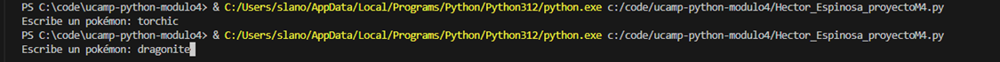
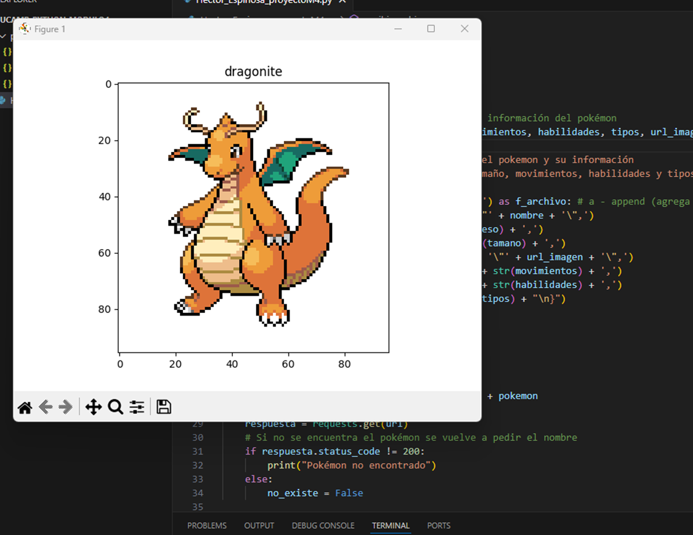
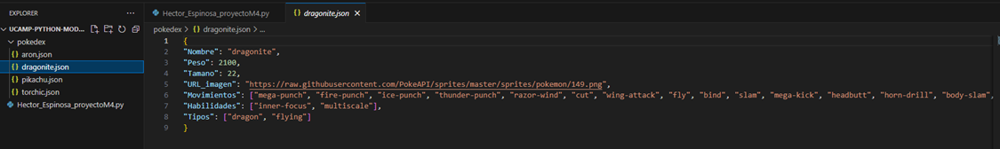

# Hector Daniel Espinosa Moreno

## Ucamp Fundamentos de Python Módulo 4

### Proyecto 4 Construcción de una pokédex

Este proyecto consiste en la creación de un programa que consume la API de pokeapi.co, la cual entrega toda la información relacionada a un pokémon que se le solicite en una petición HTTP.

El programa solicita al usuario el nombre de un pokémon y manda la petición a la API para que devuelva toda la información detallada del pokémon, a continuación se obtienen los datos del nombre, peso, tamaño, movimientos, habilidades y tipos de la respuesta y se muestra a la imagen del pokémon en una ventana emergente, después se guarda un archivo de formato JSON con la información obtenida con el nombre del pokémon en una carpeta llamada pokedex.

### Dependencias de librerías

Para poder ejecutar el programa se necesitan las librerias `requests` y `matplotlib`, que se pueden instalar usando los comandos siguientes:

```
pip install matplotlib

pip install requests
```

### Ejecución del programa

Primero se solicita el nombre del pokémon en cual se debe de escribir en la consola de python.



Después de introducir el nombre y presionar enter se mandará la petición a la API y se mostrará una ventana emergente con la imagen del pokémon introducido.



Una vez cerrada la ventana se creará un archivo de tipo json con la nombre del pokémon dentro de la carpeta pokedex que se encuentra en la raíz del repositorio.




### Conclusión

Este programa me ayudó a poner en práctica los conocimientos adquiridos sobre el uso de librerías para realizar peticiones HTTP a APIs, con estas librerias se puede realizar muchos programas que son de gran utilidad para obtener información de sistemas, poder procesarlos en python y poder mostrarlos de forma clara al usuario. 
